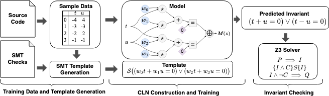

# CLN2INV
CLN2INV is the loop invariant inference system from our ICLR 2020 [paper](https://arxiv.org/pdf/1909.11542.pdf), _CLN2INV: Learning Loop Invariants with Continuous Logic Networks_. 



## Setup Instructions:
1. Install miniconda for python 3.7+: https://docs.conda.io/en/latest/miniconda.html
2. Install pytorch `conda install pytorch cpuonly -c pytorch`
  See https://pytorch.org/get-started/locally/ for other pytorch install options
3. Install other dependencies
```bash
conda install pandas matplotlib
pip install z3-solver sklearn tqdm
```


## Code2Inv benchmark 
```bash
python cln2inv.py
```

The script will run through each problem in the code2inv benchmark and print out the learned invariants, whether it passes the benchmark check, and a summary of all results.

You may also run individual problems. For example, to run problem 5:
```bash
python cln2inv.py 5
```

